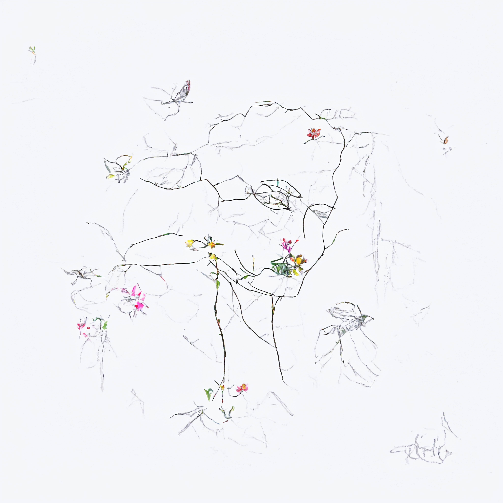
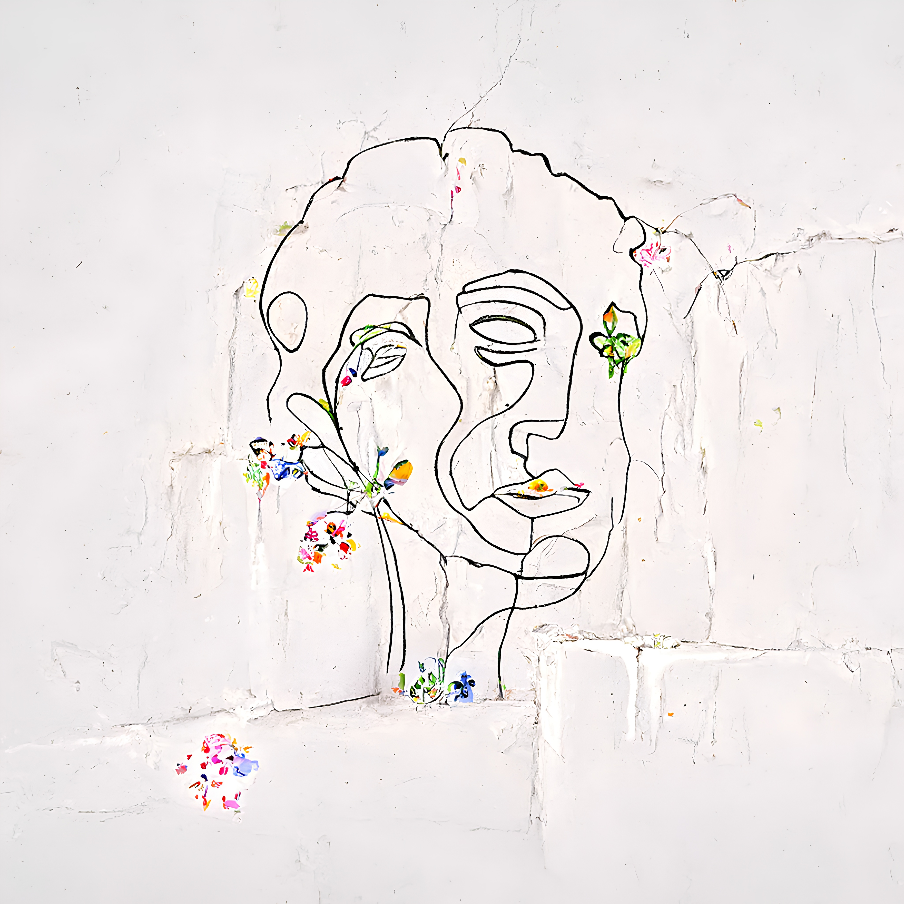
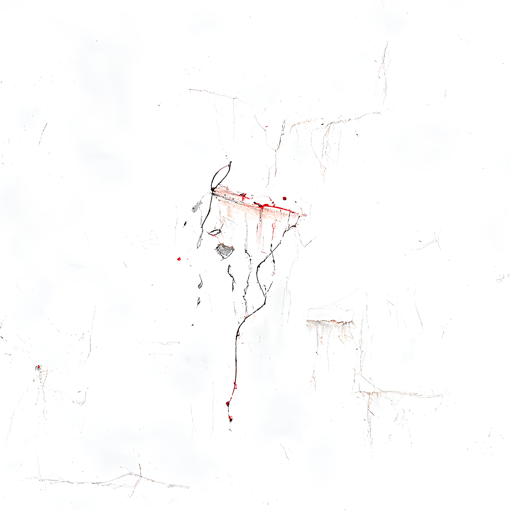

import TwoColumn from '@site/src/components/TwoColumn';
import useBaseUrl from '@docusaurus/useBaseUrl';
import VideoGallery from '@site/src/components/VideoGallery';

# Robot painting
<TwoColumn>

</TwoColumn>

<VideoGallery
  videos={[
    {
      src: useBaseUrl('/videos/penplotter.mp4'),
      title: 'Workshop Example 1'
    },

  ]}
/>

|  |  |  |
|----------------------------|----------------------------|----------------------------|